# CUDA Path Tracer

**University of Pennsylvania, CIS 565: GPU Programming and Architecture, Project 3**

* Ethan Yang
* Tested on: Windows 11, Intel(R) Core(TM) Ultra 9 275HX, 31 GB RAM, NVIDIA GeForce RTX 5060 Laptop GPU (8151 MiB VRAM), NVIDIA Driver 596.08

## Overview

This project implements a CUDA path tracer with stochastic antialiasing, diffuse and ideal specular materials, iterative path tracing with stream compaction, and optional material sorting before shading. I also implemented a bounding volume hierarchy (BVH), arbitrary OBJ mesh loading and triangle rendering, dielectric refraction with Fresnel reflection, and physically based depth of field using a thin-lens camera model.

The BVH is constructed on the CPU and stored as a flattened hierarchy for iterative traversal on the GPU. I extended this acceleration path to imported triangle meshes while retaining the naive intersection path for controlled comparisons. The OBJ loader parses polygonal faces and triangulates them for rendering. For refractive materials, I implemented Snell's law using `glm::refract`, total internal reflection, and Fresnel reflection using Schlick's approximation. For depth of field, I sample ray origins over a circular lens and redirect them toward a focal plane.

## Final Render

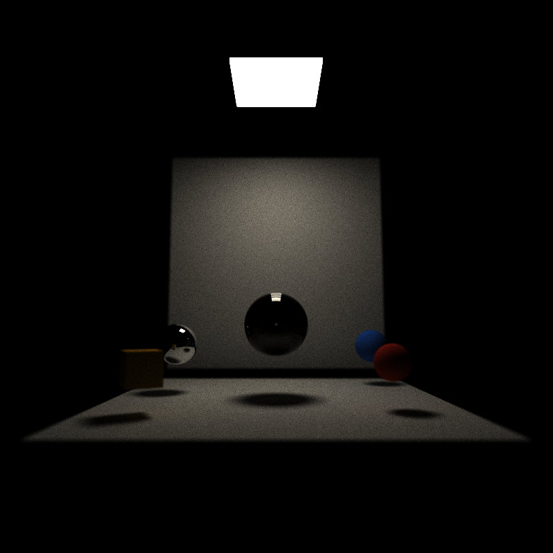

*Final showcase rendered at 800 × 800 resolution for 5000 iterations with a maximum path depth of 8. BVH traversal and material sorting were disabled for this render. The scene combines diffuse surfaces, ideal specular reflection, and dielectric refraction with Fresnel effects, while the thin-lens camera uses a lens radius of 0.18 and focal distance of 14 to introduce physically based depth of field.*


## Implementation

The path tracer runs iteratively on the GPU. At the beginning of each iteration, I generate one primary ray per pixel with a stochastic subpixel offset for antialiasing. Each bounce then intersects the active paths against the scene, shades the resulting intersections, and removes terminated paths using stream compaction. Paths continue until they hit an emissive surface, miss the scene, or reach the maximum trace depth.

### Stochastic Antialiasing

For each primary ray, I generate independent random offsets in the range `[-0.5, 0.5)` for the x and y pixel coordinates. These offsets jitter the sample location within the pixel instead of repeatedly tracing through the pixel center. The renderer accumulates these stochastic samples over successive iterations.

### Path Shading and Stream Compaction

The shading kernel handles diffuse, ideal specular, emissive, and refractive materials. Diffuse rays are sampled using the provided cosine-weighted hemisphere sampling routine, while ideal specular rays are reflected about the surface normal. When a path reaches a light, its accumulated throughput is multiplied by the light's color and emittance and the path terminates. Paths that miss the scene or exhaust their remaining bounce depth also terminate.

After each bounce, I use stream compaction to remove terminated paths from the active path array. This reduces the number of paths processed by later intersection and shading passes as rays terminate at different depths.

### Material Sorting

I also implemented material sorting before shading. I sort the intersection and path arrays together using a zipped Thrust sort keyed by material ID. Keeping the two arrays zipped preserves the correspondence between each path and its intersection while grouping paths that use the same material.

Material sorting can be enabled or disabled from the ImGui interface. I use this toggle later in the performance analysis to compare the cost of sorting against the potential benefit of grouping similar shading work.


## Bounding Volume Hierarchy

I implemented a bounding volume hierarchy (BVH) to accelerate ray-scene intersection tests. The hierarchy is constructed once on the CPU when the scene is initialized and is then copied to device memory for use during path tracing.

### BVH Construction

I first compute a world-space axis-aligned bounding box for every scene primitive. For cubes, I transform all eight corners of the local-space cube and expand the world-space bounds to contain the transformed points. The resulting primitive bounds and centroids are used to build the hierarchy recursively.

At each internal node, I choose the largest centroid extent as the split axis and divide the primitives at the median using `std::nth_element`. Construction stops when a node contains at most two primitives or reaches the configured maximum BVH depth of 32. Leaf nodes store ranges into a reordered primitive-index array, while internal nodes store the indices of their two children.

The completed hierarchy is stored in flat node and primitive-index arrays. I copy both arrays to the GPU during `pathtraceInit()` so that traversal does not require recursive CPU-side data structures.

### GPU Traversal

I implemented a separate BVH intersection kernel so that the original naive intersection path remains available for comparison. Each GPU thread traverses the hierarchy iteratively using a fixed-size local stack. Before descending into a node, the ray is tested against that node's axis-aligned bounding box using a slab intersection test. Primitive intersection tests are performed only after the traversal reaches a leaf whose bounding box intersects the ray.

The current closest intersection distance is also passed to the bounding-box test so that nodes that cannot contain a closer hit can be rejected. The final intersection information uses the same structure as the naive implementation, allowing the rest of the path-tracing pipeline to operate unchanged.

The ImGui interface includes a `Use BVH` toggle that switches between the naive and BVH intersection kernels. This made it possible to check that both implementations produced consistent renders and to measure their performance under the same scene and renderer settings.


## Arbitrary OBJ Mesh Loading

I extended the scene loader to support arbitrary geometry imported from Wavefront OBJ files. OBJ meshes are converted into triangles during scene loading and then rendered by the same path-tracing pipeline as the existing analytic primitives.

The loader supports vertex positions, vertex normals, polygonal faces, and the common OBJ face-index forms `v`, `v/vt`, `v//vn`, and `v/vt/vn`. Polygonal faces are triangulated using a triangle fan. Negative OBJ indices are also supported. When vertex normals are available, they are interpolated across the triangle using barycentric coordinates during intersection; otherwise, the loader falls back to the geometric face normal. Object transformations from the scene file are applied to the imported geometry before rendering.

Ray-triangle intersections use the Möller-Trumbore algorithm. Imported triangles participate in both intersection paths: with BVH traversal disabled, rays test the mesh triangles directly; with BVH traversal enabled, a triangle BVH is constructed on the CPU and traversed iteratively on the GPU.

### Mesh Loading Validation

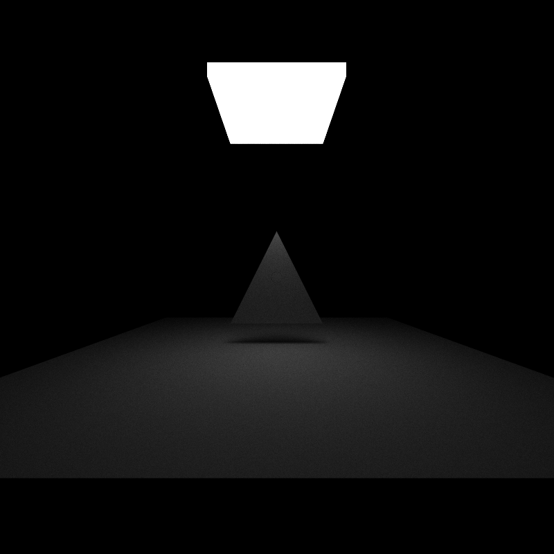

*OBJ mesh-loading validation rendered at 800 × 800 resolution for 5000 iterations with a maximum path depth of 8. BVH traversal and material sorting were disabled for this render, intentionally exercising the naive imported-triangle intersection path.*

I also verified the same imported triangle scene with BVH traversal enabled, confirming that imported geometry can be rendered through the triangle-BVH traversal path as well. This validation is intended as a correctness check rather than a performance comparison; a single-triangle mesh does not provide enough geometric complexity for a meaningful BVH speedup measurement.


### Mesh BVH Performance

To evaluate bounding-volume acceleration on a more geometrically complex imported mesh, I used a violin OBJ containing 539 polygonal face records. After the loader's triangle-fan triangulation, this produces 1,092 triangles. The benchmark scene was rendered at 800 × 800 resolution with a maximum path depth of 8 and material sorting disabled.

I compared the naive triangle-intersection path against the triangle BVH using the Debug build. With BVH traversal disabled, the application reported 1918.772 ms/frame (0.5 FPS) at 100 iterations. With BVH traversal enabled, it reported 240.142 ms/frame (4.2 FPS) at 102 iterations.

| Intersection Method | Iteration at Capture | Frame Time (ms/frame) | FPS |
|:---:|---:|---:|---:|
| Naive / BVH OFF | 100 | 1918.772 | 0.5 |
| BVH ON | 102 | 240.142 | 4.2 |


#### Visual BVH Comparison

| BVH disabled | BVH enabled |
| --- | --- |
| 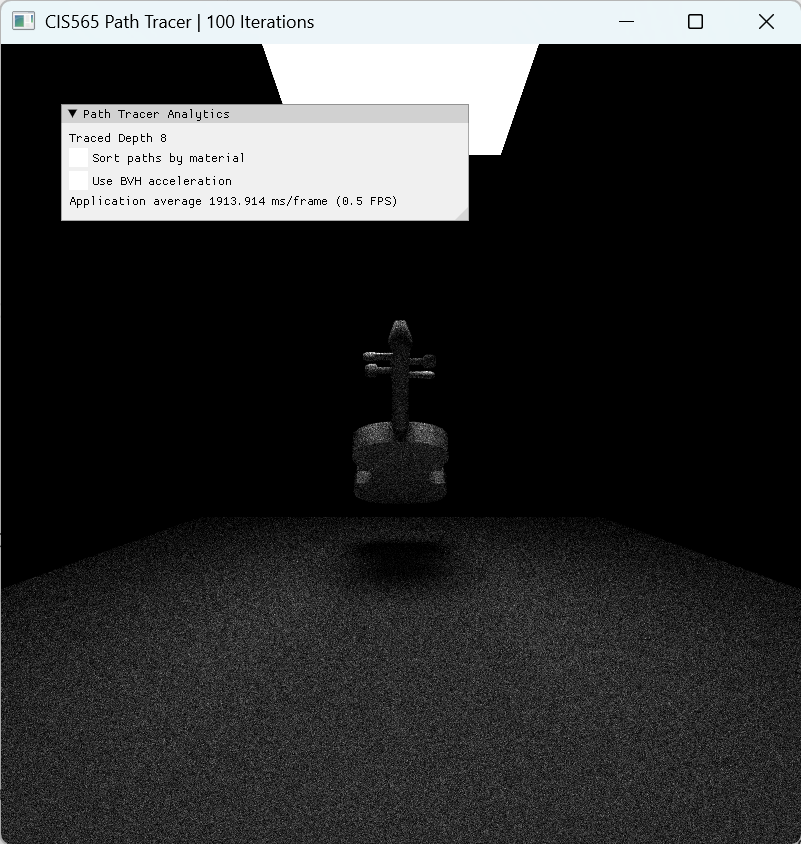 | 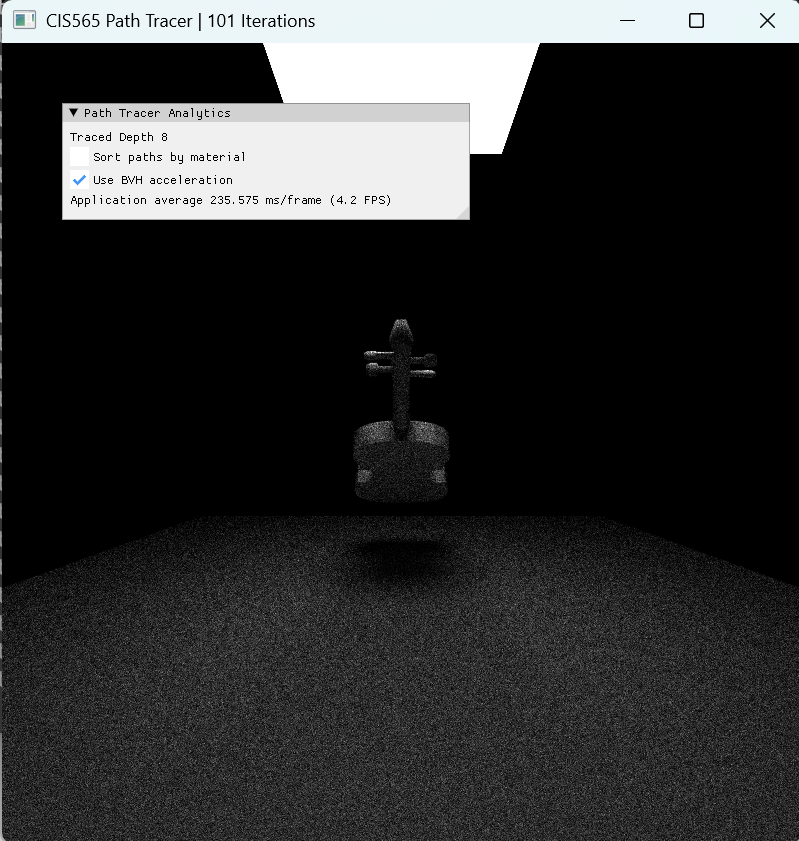 |

*Visual comparison of the same violin mesh benchmark with material sorting disabled in both runs. The left image uses the naive triangle-intersection path with BVH acceleration disabled; the right image enables BVH acceleration. The screenshots were captured at 100 and 101 iterations, respectively, and are included to show that the accelerated traversal preserves the rendered result while substantially reducing the observed application-level frame time. The formal performance comparison is reported in the table above.*


For this imported-mesh benchmark, enabling BVH traversal reduced the reported application-level frame time by approximately 87.5%, with the BVH-off frame time approximately 7.99× the BVH-on frame time. Unlike the small Cornell scene, the 1,092-triangle mesh provides substantially more primitive-intersection work for the hierarchy to eliminate. The naive path tests mesh triangles directly, whereas BVH traversal can reject groups of triangles when their bounding boxes are not intersected by the ray.

These measurements are application-level Debug-build measurements rather than isolated intersection-kernel timings, and the captures were taken at 100 and 102 iterations respectively. I therefore treat the result as evidence for the benefit of the BVH in this particular imported-mesh workload rather than as a general performance guarantee.

The hierarchy is constructed once on the CPU and traversed iteratively by GPU threads during rendering. A CPU renderer could use the same hierarchical culling principle to reduce triangle-intersection tests, but I did not benchmark a CPU path tracer and therefore do not make a measured CPU-versus-GPU performance claim. Further optimization could include surface-area-heuristic BVH construction, near-first child traversal, and more compact node and triangle layouts to improve memory-access behavior.


### Scene Format

OBJ meshes are specified as objects with `TYPE` set to `mesh` and a `FILE` path identifying the OBJ file. The mesh uses a material defined in the scene's `Materials` section and supports the same translation, rotation, and scale fields used for other scene objects. For example:

```json
{
    "TYPE": "mesh",
    "FILE": "meshes/mesh_benchmark/Violin.obj",
    "MATERIAL": "mesh_white",
    "TRANS": [-1.95, 1.31, 0.78],
    "ROTAT": [0.0, 0.0, 0.0],
    "SCALE": [1.0, 1.0, 1.0]
}
```

The `mesh_benchmark.json` scene uses this format for the imported violin mesh used in the triangle-BVH performance comparison.


## Refraction and Fresnel

I added an ideal dielectric material type to support refraction in the path tracer. Refractive materials specify an index of refraction (IOR) in the scene file. During shading, I determine whether the ray is entering or exiting the material and use the corresponding incident and transmitted indices of refraction.

I use `glm::refract` to compute the transmitted direction according to Snell's law. If transmission is not possible, the ray undergoes total internal reflection. Otherwise, I use Schlick's approximation to estimate the Fresnel reflectance and stochastically choose between the reflected and transmitted directions. This makes reflection more likely at grazing angles while still allowing transmission through the dielectric.

### Refraction Comparison

To isolate the effect of the index of refraction, I rendered the same scene with the same camera and renderer settings while changing only the glass material's IOR. The first image uses an IOR of 1.0, which acts as an optically matched control. The second uses an IOR of 1.5.

| IOR = 1.0 control | IOR = 1.5 glass |
|:---:|:---:|
|  | 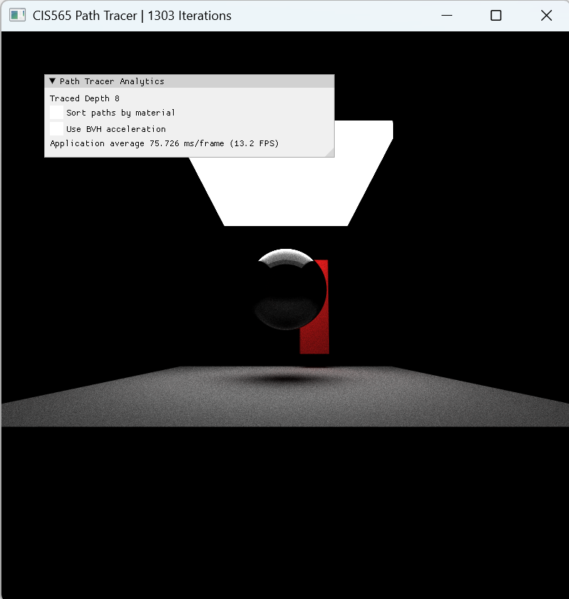 |

With an IOR of 1.0, the dielectric does not bend transmitted rays relative to the surrounding medium. Increasing the IOR to 1.5 changes the transmitted ray directions and visibly remaps the geometry seen through the sphere. The comparison is consistent with the Snell's-law and Fresnel behavior implemented in the shader.


### Performance and Further Optimization

I did not isolate refraction with a dedicated timing benchmark, so I do not claim a measured performance change for this feature. Compared with the diffuse and ideal specular paths, the refractive shading path adds calculations for the incident/transmitted IORs, total internal reflection, Schlick Fresnel reflectance, and the stochastic reflection-versus-refraction decision. Refraction is a rendering feature rather than an acceleration structure, so its purpose here is to extend the set of light-transport effects that the path tracer can represent rather than to reduce render time.

A CPU implementation would perform the same underlying Snell's-law, Fresnel, and total-internal-reflection calculations, but its execution characteristics would differ from CUDA's SIMT execution. On the GPU, neighboring paths can take different reflection and transmission branches, which can introduce divergence.

Further extensions could include wavelength-dependent dispersion, absorption through participating dielectric media, or rough dielectric surfaces. These are not implemented in the current renderer.


### Scene Format

I extended the material format with a `Refractive` type and an `IOR` parameter. For example:

```json
"glass": {
    "TYPE": "Refractive",
    "RGB": [1.0, 1.0, 1.0],
    "IOR": 1.5
}

```

The `refraction_showcase.json` scene uses this material to demonstrate the refractive implementation.


## Physically Based Depth of Field

I extended the camera with a physically based thin-lens depth-of-field model. The original pinhole ray is still generated first, including its stochastic antialiasing offset. I then use that ray to determine a point on the focal plane.

When the lens radius is greater than zero, I uniformly sample a point on a circular lens. I use the square root of a uniform random sample when computing the sample radius so that samples are distributed uniformly over the area of the disk rather than concentrated near its center. The ray origin is moved to this sampled lens position and its direction is changed so that it passes through the focal point determined by the original pinhole ray.

A lens radius of zero skips the thin-lens calculation and preserves the original pinhole-camera behavior.

### Depth-of-Field Comparison

I first compared the pinhole camera against the thin-lens camera while keeping the focal distance at 12.0.

| Pinhole, lens radius = 0.0 | Thin lens, lens radius = 0.3 |
|:---:|:---:|
| 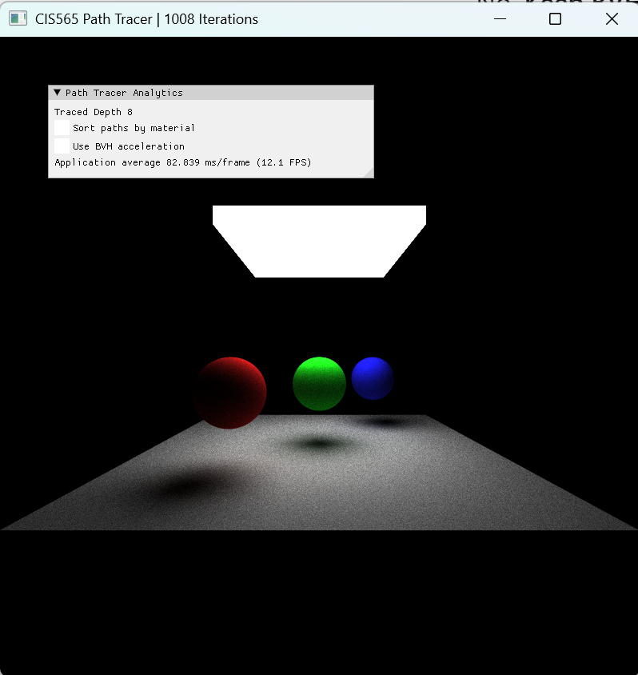 |  |

With the pinhole camera, objects at different depths remain comparatively sharp. With a lens radius of 0.3 and focal distance of 12.0, the middle green sphere remains relatively sharp while objects away from the focal plane become defocused.

I also changed only the focal distance from 12.0 to 9.0 while keeping the lens radius at 0.3. This moves the focal plane toward the camera.

| Focal distance = 12.0 | Focal distance = 9.0 |
|:---:|:---:|
|  | 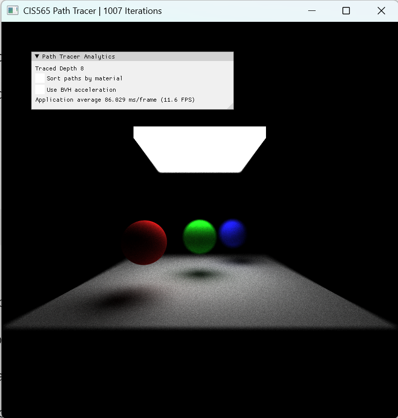 |

At a focal distance of 9.0, the nearer red sphere becomes sharper while the middle and farther spheres become more defocused. This provides a second check that the blur is depth-dependent and responds to the specified focal plane rather than being applied as a uniform image-space blur.


### Performance and Further Optimization

I did not isolate depth of field with a dedicated timing benchmark, so I do not claim a measured performance change for this feature. When the lens radius is greater than zero, primary-ray generation performs additional random sampling and arithmetic to sample the circular lens, determine the focal point, and construct the modified ray. The subsequent path-tracing pipeline is unchanged. When the lens radius is zero, the thin-lens calculation is skipped and the original pinhole-camera path is preserved.

Depth of field is a rendering feature rather than an acceleration technique, so it is not intended to reduce render time. Its additional stochastic sampling can require more accumulated samples for a visually converged defocused image because each iteration samples a different point on the lens.

A CPU implementation could use the same thin-lens camera model and sampling procedure. The underlying camera calculations are independent for each primary ray and therefore naturally parallel, although the GPU can process large numbers of these rays concurrently.

Further optimization could reduce redundant camera-basis calculations or investigate sampling strategies that reduce variance in the lens samples. These optimizations are not implemented in the current renderer.


### Scene Format

I added two optional camera parameters:

* `LENS_RADIUS` controls the radius of the sampled lens aperture.
* `FOCAL_DISTANCE` specifies the distance from the camera to the focal plane along the camera's forward direction.

For example:

```json
"Camera": {
    "LENS_RADIUS": 0.3,
    "FOCAL_DISTANCE": 12.0
}
```

Scenes that do not specify `LENS_RADIUS` default to a lens radius of zero and therefore retain the original pinhole-camera behavior. If `FOCAL_DISTANCE` is omitted, it defaults to the distance between the camera position and its look-at point. The `dof_showcase.json` scene demonstrates the thin-lens implementation.


## Performance Analysis

I measured the performance impact of material sorting and BVH traversal using the Cornell box scene. These measurements were collected from the interactive application using the Debug build on the system listed at the top of this README. Because these are application-level measurements rather than isolated CUDA kernel microbenchmarks, I treat them as representative measurements for this scene and configuration rather than general performance guarantees.

For each comparison, I kept the scene, camera, maximum path depth, and other renderer options fixed while changing the feature being tested.


### Stream Compaction

After each bounce, I compact the path array by removing paths that have terminated. This reduces the number of paths processed by later intersection and shading passes. To examine how this changes the active workload within a single iteration, I recorded the number of active paths immediately after stream compaction at every bounce.

I compared the provided open Cornell scene against a closed version of the same scene. The closed scene keeps the original camera and Cornell geometry unchanged but adds a large diffuse enclosure around the scene and camera so that rays that would otherwise escape instead continue interacting with geometry.

| Bounce | Open Cornell | Closed Cornell |
|---:|---:|---:|
| 1 | 522,808 | 629,450 |
| 2 | 373,004 | 608,847 |
| 3 | 297,374 | 590,505 |
| 4 | 245,212 | 572,674 |
| 5 | 206,437 | 556,686 |
| 6 | 175,952 | 542,025 |
| 7 | 151,727 | 528,664 |
| 8 | 0 | 0 |

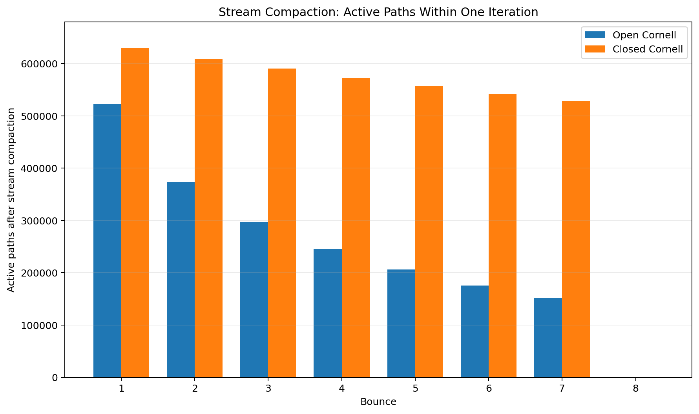

*Active paths after each stream-compaction step during one iteration. Both scenes use an 800 × 800 image and a maximum path depth of 8.*

The difference becomes larger at later bounces. The open Cornell scene starts with 640,000 primary paths and has 151,727 active paths remaining after bounce 7, or about 23.7% of the original paths. In the closed scene, 528,664 paths remain after bounce 7, or about 82.6%. Rays in the open scene can leave the scene and terminate, while the added enclosure in the closed scene causes those rays to continue bouncing. Paths can also terminate when they reach the emissive surface.

This illustrates where stream compaction is useful: as paths terminate, later intersection and shading passes operate on a smaller active path array instead of continuing to process every original path. The benefit is therefore expected to be larger for the open scene, where the active path count falls much more quickly. The active-path counts measure the reduction in work presented to later kernels rather than execution time directly, so I do not treat them as a direct timing measurement. At bounce 8, both counts reach zero because the configured maximum path depth is 8 and the remaining paths exhaust their bounce budget.


### Material Sorting

I compared material sorting with BVH traversal disabled. The sorting-disabled render reached 302 iterations and reported 441.888 ms/frame, while the sorting-enabled render reached 105 iterations and reported 2493.033 ms/frame.

| Material Sorting | Frame Time (ms/frame) | FPS |
|:---:|---:|---:|
| OFF | 441.888 | 2.3 |
| ON | 2493.033 | 0.4 |

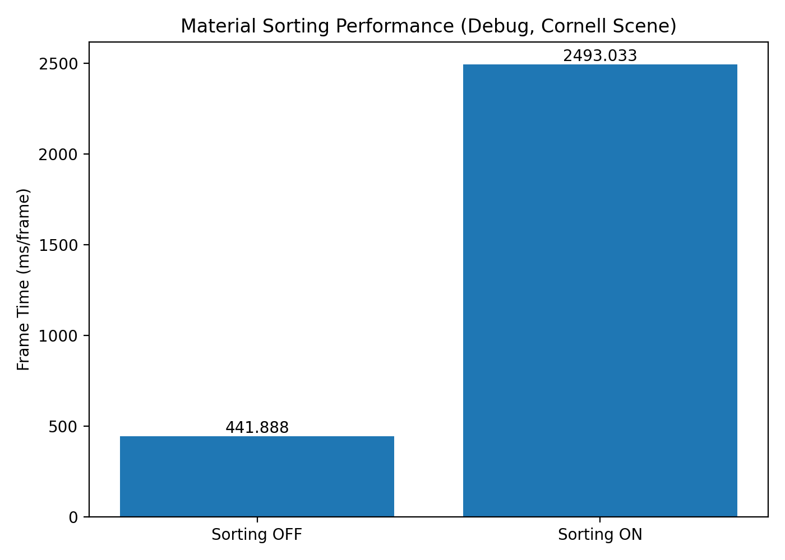

*Material sorting performance measured using the Debug build and Cornell box scene.*

In this test, enabling material sorting increased the measured frame time substantially. My implementation performs a Thrust sort of the zipped intersection and path arrays before shading at each bounce. Although grouping paths by material can improve coherence during shading, the Cornell scene has a relatively small and simple set of materials, and the additional sorting work can outweigh that benefit in this configuration. The measured result therefore does not show a performance improvement from material sorting for this scene.

The two renders below were used for the controlled comparison.

| Material Sorting OFF | Material Sorting ON |
|:---:|:---:|
| 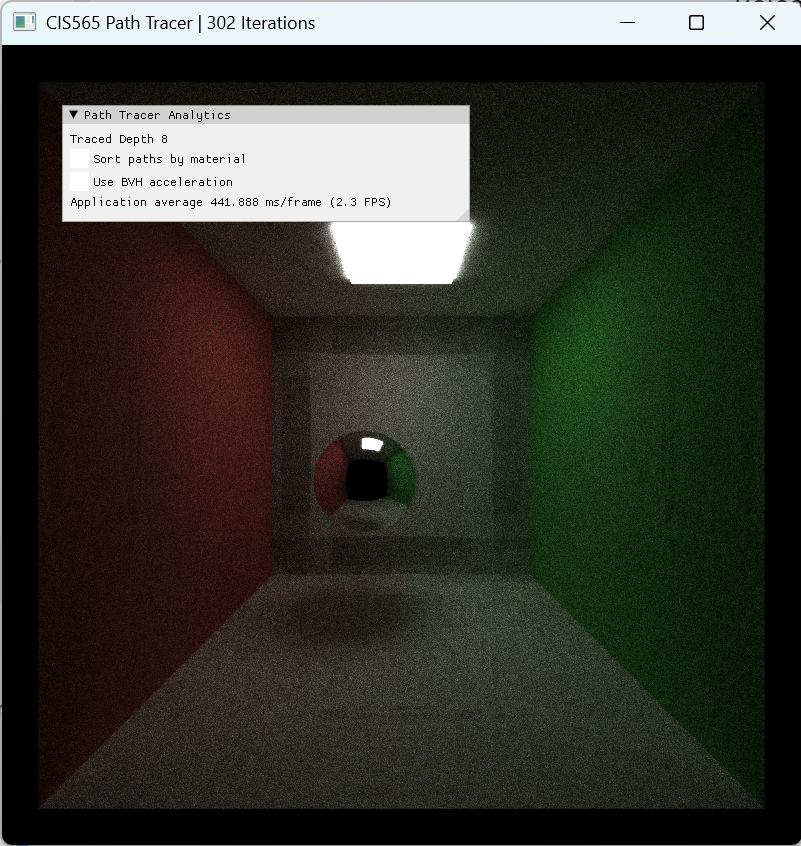 |  |

A more optimized implementation could reduce sorting overhead or avoid sorting when the expected coherence benefit is too small. A more complex scene with more expensive or divergent material evaluation could also change the tradeoff. On a CPU implementation, grouping work by material could improve cache locality and potentially reduce changes between different shading code paths, but the GPU-specific tradeoff involving sorting overhead, SIMT divergence, and memory behavior would not transfer directly.

### BVH Traversal

I also compared the naive intersection kernel against BVH traversal with material sorting disabled. Both measurements were taken at 501 iterations.

| Intersection Method | Frame Time (ms/frame) | FPS |
|:---:|---:|---:|
| Naive / BVH OFF | 440.780 | 2.3 |
| BVH ON | 541.705 | 1.8 |

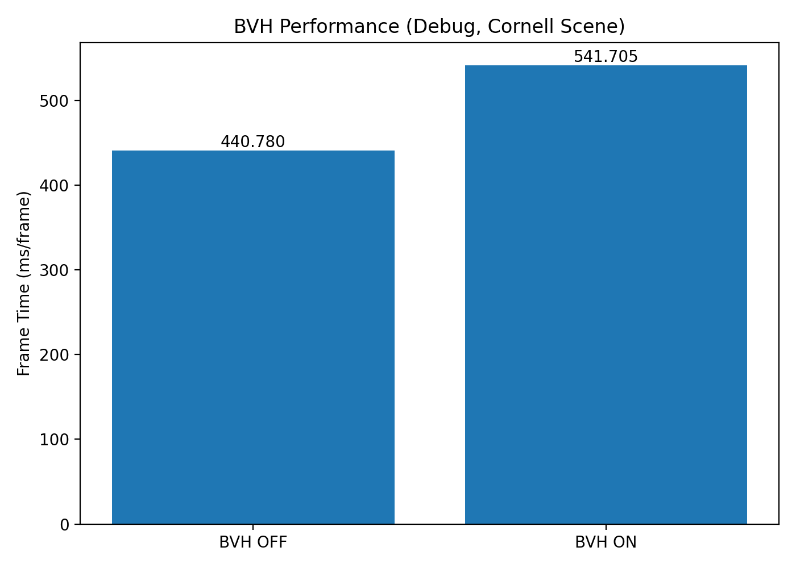

*BVH performance measured using the Debug build and Cornell box scene.*

For this Cornell scene, the BVH implementation did not reduce the measured frame time. BVH traversal avoids testing every primitive by rejecting nodes whose bounding boxes do not intersect the ray, but traversal itself introduces bounding-box intersection tests, stack operations, branches, and additional memory accesses. Because this scene contains relatively few primitives, there is limited unnecessary primitive-intersection work for the hierarchy to eliminate, so the traversal overhead can outweigh the savings.

The controlled renders below use the same scene and renderer settings with only BVH traversal changed.

| BVH OFF | BVH ON |
|:---:|:---:|
| 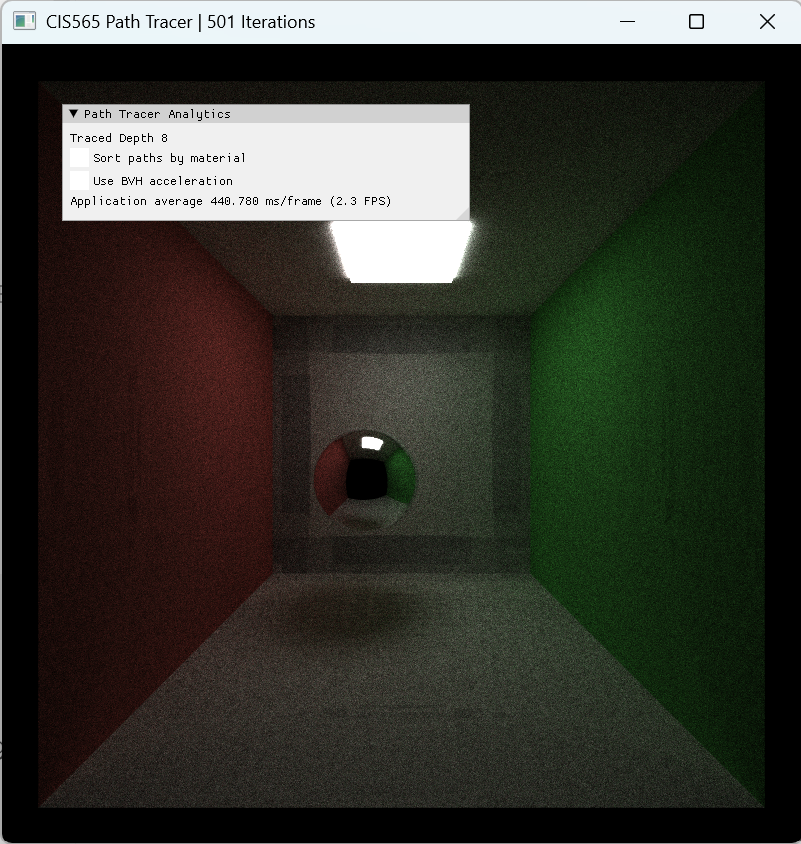 |  |

This result should not be interpreted as showing that BVHs are generally slower than naive traversal. The current implementation uses a straightforward median split along the largest centroid extent and iterative traversal with a local stack. A larger or more geometrically complex scene provides more opportunity for hierarchical culling to reduce primitive intersection tests. Further optimizations could include a surface-area-heuristic construction strategy, near-first traversal, and a node layout designed to reduce traversal and memory-access overhead.

A CPU implementation would also benefit from reducing the number of primitive intersection tests as scene complexity increases, although its execution and memory behavior would differ from the GPU implementation. The GPU version additionally has to consider SIMT divergence and per-thread traversal state.


## Build and Run

I built and tested the project on Windows 11 using CMake, Visual Studio, and an NVIDIA CUDA-capable GPU. The system used for testing is listed at the top of this README.

I modified `CMakeLists.txt` to expose the CUDA toolkit include directories to the build and to add the MSVC `/Zc:preprocessor` option needed by my Windows/Visual Studio configuration.

From a Visual Studio x64 developer environment, configure and build the Debug version with:

```bat
cmake -S . -B .\out\build\x64-Debug
cmake --build .\out\build\x64-Debug --config Debug
```

Run the path tracer by passing a scene JSON file to the executable. For example:

```bat
.\out\build\x64-Debug\bin\cis565_path_tracer.exe .\scenes\cornell.json
```

The custom scenes used for feature demonstrations, analysis, and the final render include `mesh_test.json`, `mesh_benchmark.json`, `refraction_showcase.json`, `dof_showcase.json`, `cornell_closed.json`, and `final_showcase.json`.

The interactive interface provides controls for enabling or disabling material sorting and BVH traversal. The custom refraction and depth-of-field parameters are specified in their scene JSON files as described above.


## Third-Party Assets

The violin model used in the OBJ mesh-loading and BVH benchmark is from **Sam's Simple Instruments** by **Sam Meese**, released under the **CC0 1.0 Universal** public-domain dedication. The original asset pack is available from [Sam's Simple Instruments on itch.io](https://sammeese.itch.io/simple-instruments-assets).